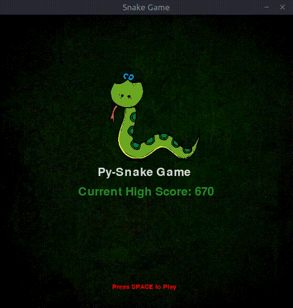

# Snake Game

A simple game built using PyGame python library. The main objective is to learn to use the library.

## Rules

Inspired by the retro game, 
- The snake has to catch the target fruit for a scoreup
- Game Over if the snake hits itself
- No Walls present
- Speed of the snake increases gradually

## Installation

Nothing much, only `python` and `pygame` is all you need. 

#### PIP Installation
```sh
$ sudo apt install python3.6
$ pip install pygame
```

#### Virtual Environment
```sh
$ conda create -n pygame_env python=3.6 
$ conda activate pygame_env
$ pip install pygame
```

#### Run
```sh
$ python snakegame.py
```

## Gameplay



  
